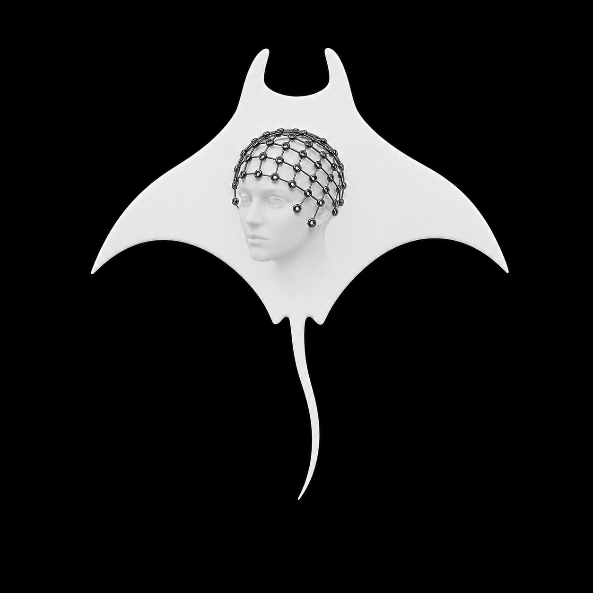

# MANTA

<p align="center">
  
</p>

MANTA is a work-in-progress iPhone and iPad application for capturing EGI
HydroCel 128- and 256-channel EEG nets with LiDAR and photogrammetry. The goal
is to locate and label electrodes, anchor them to nasion/LPA/RPA fiducials,
review uncertain results, and export electrode coordinates. A planned macOS
receiver will import the same captures for transfer, archival, offline solving,
and reprocessing with newer pipelines.

MANTA is research software. It has not yet been validated for clinical use.

## Current state

Implemented and tested:

- LiDAR and photogrammetry capture with persisted RGB, depth, confidence,
  intrinsics, and camera poses.
- EGI HydroCel 128/256 layout loading.
- OCR-first electrode detection plumbing, multi-frame fusion, geometric
  validation, and template-based fill for missing observations.
- Photogrammetry-to-AR-world alignment and fiducial-anchored head coordinates.
- Session library and whole-session ZIP export.
- CSV, SFP, ELP, and BIDS-compatible electrode export.
- A local `MANTACore` Swift package shared with the planned macOS app.

The principal outstanding work is real-device tuning and validation, precise
disk-center localization, a stable versioned capture format, completion of the
shared-core refactor, and the macOS receiver.

## Repository layout

```text
MANTA/                 iOS application code
MANTACore/             local cross-platform Swift package
MANTATests/            iOS application tests and synthetic scan harness
Fixtures/              EGI layouts and future capture fixtures
Docs/                  architecture, format, validation, and roadmap
MANTA.xcodeproj/       iOS and macOS Receiver application targets
```

The project now also contains a `MANTA Receiver` macOS scheme for importing,
validating, and inspecting local `.manta` archives.

See [Architecture](Docs/ARCHITECTURE.md), [Capture format](Docs/CAPTURE_FORMAT.md),
[Data privacy](Docs/DATA_PRIVACY.md), [Validation](Docs/VALIDATION.md), and
[TODO](Docs/TODO.md).

## Requirements

- Xcode with the SDK selected by the project.
- A LiDAR-equipped iPhone Pro or iPad Pro for real capture.
- The simulator can exercise the library, review, persistence, detection, and
  export flows, but cannot validate LiDAR, camera, or AR raycasting.
- iOS/iPadOS 26+ and macOS 13+ for `MANTACore`. Real capture requires a
  LiDAR-equipped device supported by the application.

## Build and test

Run the portable package tests on the Mac host:

```sh
cd MANTACore
swift test
```

Run the application unit tests with an installed iPad simulator, adjusting the
destination to one available locally:

```sh
xcodebuild test \
  -project MANTA.xcodeproj \
  -scheme MANTA \
  -destination 'platform=iOS Simulator,name=iPad Pro 11-inch (M5)' \
  -only-testing:MANTATests \
  CODE_SIGNING_ALLOWED=NO
```

For a real capture, build the `MANTA` scheme to a LiDAR device. Capture guidance
and fixture hand-off instructions are in [Validation](Docs/VALIDATION.md).
